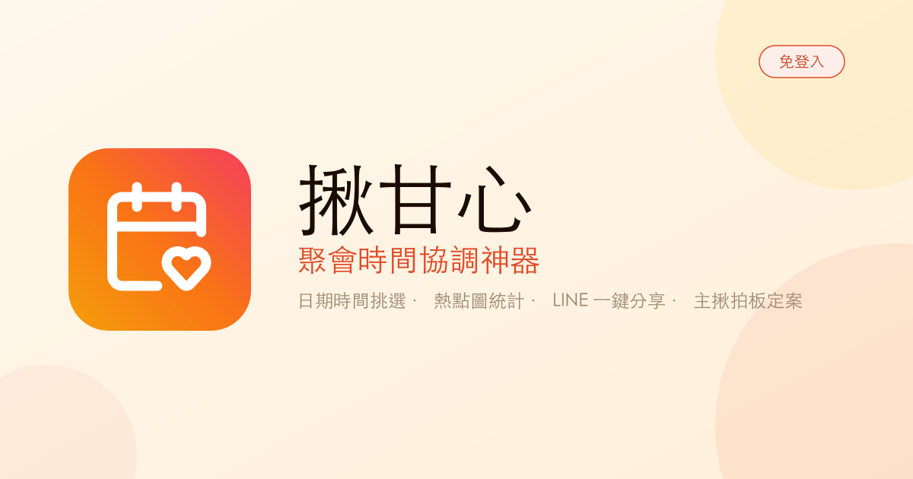

# 揪甘心

**聚會時間協調神器** — 免登入的聚會時間協調工具，支援日期時間挑選、熱點圖統計、LINE 一鍵分享與主揪拍板定案。

## 專案定位（重要）

本專案是**純靜態頁面 Demo**，用途是展示給工程師看整體流程與介面設計，**不是要串接真實後端或第三方服務的正式產品**。

- **Google OAuth / 登入是假畫面**：規格書中提到的「主揪 Google SSO 登入」在此 Demo 中僅以前端模擬的方式呈現登入流程與 UI 狀態（例如假的登入按鈕、假的頭像、假的登出選單），**不會真的呼叫 Google OAuth API**，純粹是為了讓看 Demo 的人能理解「這裡未來會是登入情境」並在介面上模擬操作行為。
- 同理，AI 推薦餐廳等功能若規格書提及串接 Google Places / Perplexity / LLM，在此 Demo 階段也可能先以假資料（mock）呈現流程，不代表已完成真實串接。
- 修改此專案 UI 時，請維持「純前端、可直接跑在 GitHub Pages」的靜態架構，不要為了做假登入而加入真正的後端驗證邏輯。

## 功能特色

- 📅 日期時間挑選 — 快速建立候選時段
- 🔥 熱點圖統計 — 即時彙整大家的可行時間
- 💬 LINE 一鍵分享 — 邀請朋友快速填寫
- 👑 主揪拍板定案 — 一鍵確定最終聚會時間
- 🙅 免登入 — 不需註冊帳號即可使用

## 本機執行

**前置需求：** Node.js

1. 安裝套件：
   `npm install`
2. 複製 [.env.example](.env.example) 為 `.env.local`，並設定 `GEMINI_API_KEY`
3. 啟動開發伺服器：
   `npm run dev`

## 部署

專案透過 GitHub Actions 自動建置並部署至 GitHub Pages（見 [.github/workflows](.github/workflows)）。
