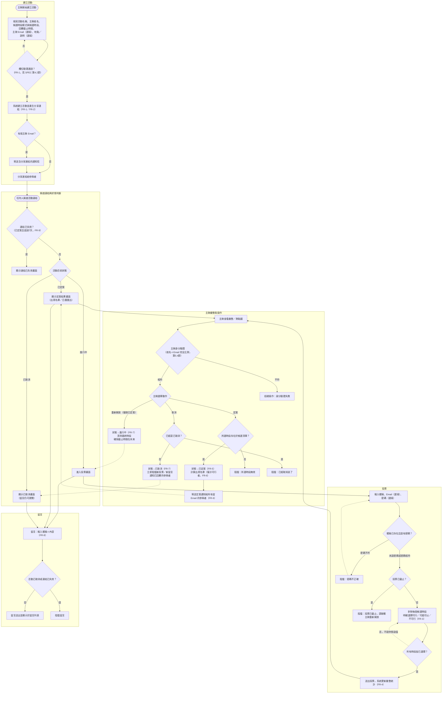
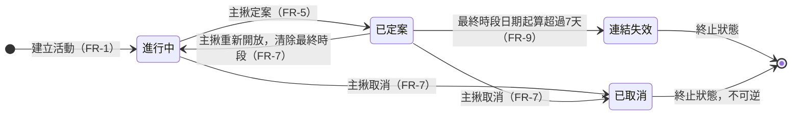

# 揪甘心 — 系統流程圖

本頁補充 [SPEC.md](./SPEC.md)、[PRD](./prd/README.md) 的文字規格，用兩張圖呈現 Phase 1 的完整系統流程：第一張是「主揪建立活動 → 參與者投票 → 主揪定案／取消／重新開放 → 留言」的完整流程與驗證關卡；第二張是活動狀態（進行中／已定案／已取消／連結失效）之間的轉換關係。圖中節點標註的 FR 編號對應 [SPEC.md 第 4 節](./SPEC.md)的功能需求。

---

## 一、主流程圖

> 圖中實線箭頭為正向流程；虛線箭頭代表「重試」或「主揪操作後回到某畫面」的迴圈，非主要閱讀路徑。

---

## 二、活動狀態轉換圖

**補充說明**：

- 「已取消」與「連結失效」都是終止狀態，但阻擋範圍不同——已取消會立即阻擋新投票與新留言（見 FR-7），連結失效則會阻擋所有互動（投票、留言、查看彙整，見 FR-9）。兩者判斷邏輯彼此獨立：連結失效只針對「已定案且已選定最終時段」的活動計算天數，「進行中」的活動不論多舊都不會因此失效。
- 「重新開放」只能從「已定案」回到「進行中」，「已取消」目前沒有任何路徑可以回到其他狀態。

---

[回到 SPEC.md](./SPEC.md) ｜ [回到 PRD 索引](./prd/README.md)
